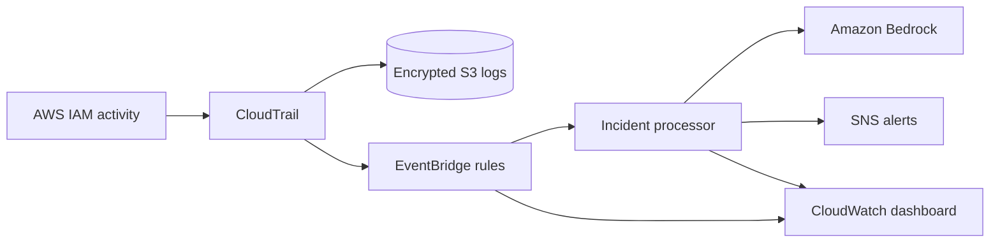

# AWS AI SOC Dashboard

An infrastructure-as-code security monitoring lab that turns high-value AWS IAM activity into prioritized incident notifications and an operational CloudWatch dashboard.

## What it demonstrates

- Multi-region CloudTrail collection with log-file validation
- EventBridge detection of sensitive IAM changes
- Python Lambda enrichment and risk scoring
- Amazon Bedrock-assisted incident summaries
- SNS alert delivery and CloudWatch operational visibility
- Terraform-managed infrastructure with least-privilege service roles

## Architecture



## Security design

- S3 public access is blocked, versioning is enabled, and logs are encrypted at rest.
- CloudTrail validates log integrity and captures global management events.
- Lambda can publish only to the project SNS topic; service trust policies are explicit.
- Personal alert destinations belong only in an ignored local `terraform.tfvars` file.
- CI performs formatting and validation without storing long-lived cloud credentials.

> This repository is a defensive lab. It contains no production data or AWS credentials.

## Repository layout

```text
lambda/       Python parsing, MITRE mapping, risk scoring, and notification logic
terraform/    CloudTrail, EventBridge, Lambda, SNS, S3, IAM, and dashboard resources
```

## Validate locally

```bash
cd lambda
zip -r lambda.zip . -x "lambda.zip" "__pycache__/*" "*.pyc"
cd ../terraform
cp terraform.tfvars.example terraform.tfvars
terraform init
terraform fmt -check -recursive
terraform validate
terraform plan
```

Review the plan before applying it. CloudTrail, CloudWatch, SNS, Lambda, S3, and Bedrock can incur charges.

## Next security improvement

Configure GitHub Actions OIDC with a repository- and branch-scoped AWS role before enabling automated plans. Long-lived AWS access keys should not be stored in GitHub.
